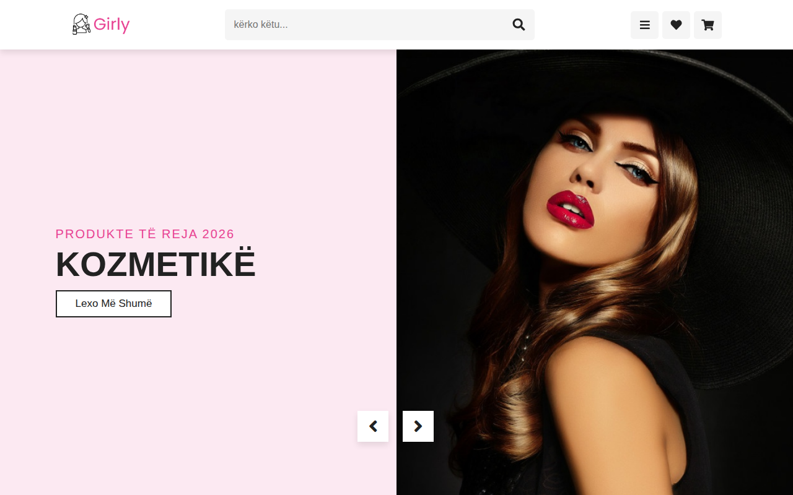

# Dyqan Kozmetike — Cosmetics Website

Faqe dyqani kozmetike — produkte bukurie dhe kontakt, e përshtatur plotësisht në shqip.



**Demo live:** https://erionnezha.github.io/Cosmetics-Website/

## Përshkrimi

Faqe moderne dhe plotësisht responsive për një dyqan kozmetike:

- Hero slider me kategoritë kryesore (kozmetikë, aksesorë, kujdes për lëkurën)
- Kategoritë e produkteve: kozmetikë, makijazh, pudër, losione, buzëkuq, maskarë
- Dyqani me produkte të zgjedhura (çmimet janë vetëm demo/shembull)
- Galeri fotografike, seksioni i ekipit, produkte të reja
- Artikuj për bukurinë dhe kujdesin e lëkurës
- Shërbimet: dërgesë falas, pagesë e sigurt, mbështetje 24/7
- Formular buletini dhe informacion kontakti

**Kontakt:** +355 6XX XXX XXX · shembull@example.com · Tiranë, Shqipëri

## Si hapet lokalisht

Nuk kërkon server — thjesht hapni `index.html` në shfletues, ose shërbejeni lokalisht:

```bash
cd Cosmetics-Website
python3 -m http.server 8000
# pastaj hapni http://localhost:8000
```

Të gjitha libraritë (Font Awesome, Swiper, LightGallery) janë lokale në dosjen `vendor/` — faqja funksionon edhe pa internet.

## Teknologjitë

- HTML5, CSS3 (SCSS origjinal në `css/style.scss`), JavaScript
- Swiper (slider produktesh), LightGallery (galeri), Font Awesome (ikona)

## Licenca

MIT — shihni [LICENSE](LICENSE). © 2026 Erion Nezha.

---

# Cosmetics Website

A cosmetics shop page — beauty products and contact, fully localized in Albanian.


**Live demo:** https://erionnezha.github.io/Cosmetics-Website/

## Description

A modern, fully responsive page for a cosmetics shop:

- Hero slider with main categories (cosmetics, accessories, skin care)
- Product categories: cosmetics, makeup, powder, lotions, lipstick, mascara
- Shop with featured products (prices are demo placeholders)
- Photo gallery, team section, new arrivals
- Beauty and skin-care blog articles
- Services: free shipping, secure payment, 24/7 support
- Newsletter form and contact info

**Contact:** +355 6XX XXX XXX · shembull@example.com · Tirana, Albania

## Running locally

No server required — just open `index.html` in a browser, or serve it locally:

```bash
cd Cosmetics-Website
python3 -m http.server 8000
# then open http://localhost:8000
```

All libraries (Font Awesome, Swiper, LightGallery) are vendored locally in `vendor/` — the page works offline.

## Technologies

- HTML5, CSS3 (original SCSS in `css/style.scss`), JavaScript
- Swiper (product sliders), LightGallery (gallery), Font Awesome (icons)

## License

MIT — see [LICENSE](LICENSE). © 2026 Erion Nezha.
